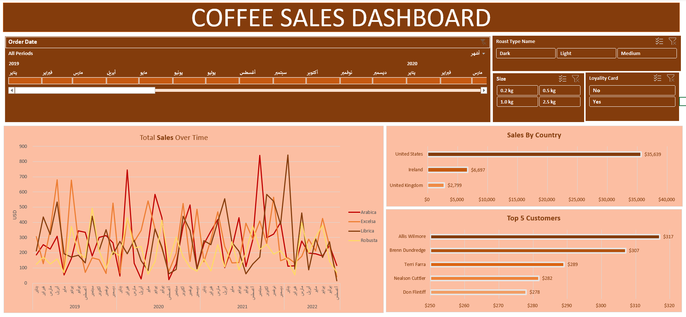

# Coffee Sales Dashboard (Excel Project)
## Dashboard Preview

## Overview

This project is an interactive Coffee Sales Dashboard built using Microsoft Excel. It analyzes coffee sales data across different countries, customers, roast types, and sizes.

## Features

* Interactive Dashboard
* Sales trends over time
* Sales by country
* Top customers analysis
* Filters using Timeline and Slicers
* Pivot Tables and Pivot Charts

## Tools Used

* Microsoft Excel
* Pivot Tables
* Pivot Charts
* XLOOKUP
* INDEX MATCH
* IF Functions
* Timeline and Slicers
* Data Formatting
